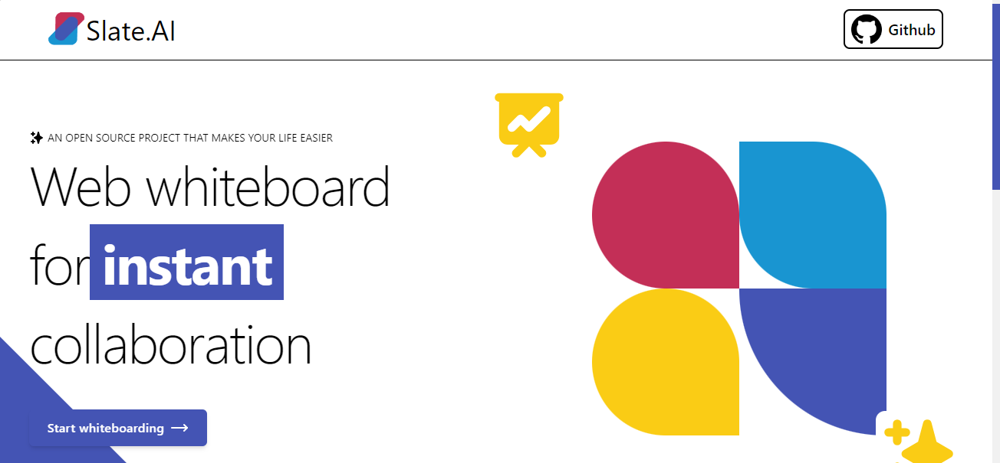
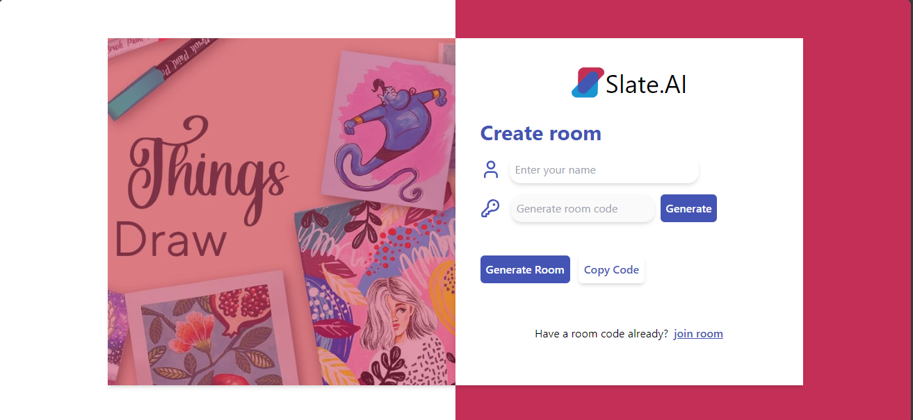
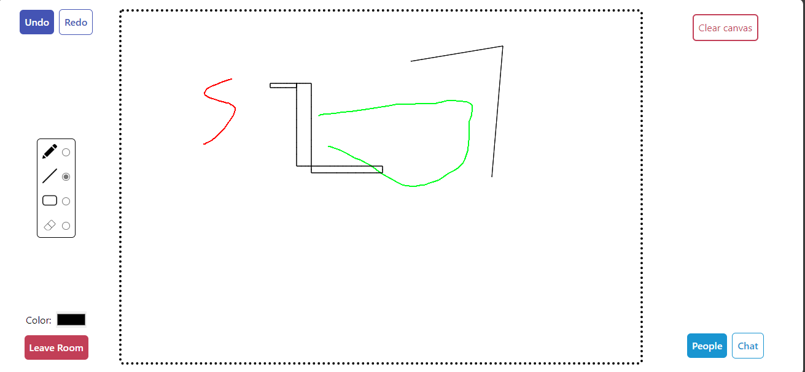
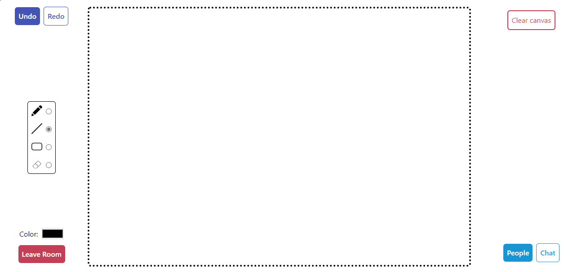

# `The Curent version does not support mobiles Devices`

<div align="center">


</div>

 <!-------------------------------------------------------------------------------------------------------------------------------------->
 <div align="center">
 <p>

[](https://github.com/ellerbrock/open-source-badges/)


 </p>
 </div>

<!-- --------------------------------------------------------------------------------------------------------------------------------------------------------- -->

<h3 align="center">Participating in</h3>
<div align="center"><a href="#"></a></div>

Website - https://www.jwoc.tech/


## About The Project

Slate.AI is a real-time collaborative whiteboarding web application, allowing multiple users to collaboratively create art using a shared canvas. Built with the MERN stack and Socket.IO, Slate.AI provides a seamless and engaging collaborative drawing experience.

## Features

- Real-time collaboration on a shared canvas.
- Create and join rooms for collaborative drawing sessions.
- Group chat feature inside a room.
- MERN stack for robust and scalable architecture.
- Socket.IO for efficient real-time communication.

## Tech Stack


## Demo

### Landing Page


### Create/Join Room Page


### Whiteboard with realtime collaboration and Room Chat features




## Getting Started

Follow these steps to set up and run Slate.AI locally.

### Prerequisites

- Node.js and npm installed on your machine.

### Installation

### Open Terminal

Open cmd or any other terminal you have.
Then run the following commands.

### Clone the repo
   ```sh
   git clone git@github.com:sd012gfhkhhvh/Slate.AI.git
   ```
#### Client

```bash
cd client
npm install
```

#### server
```bash
cd server
npm install
```
### Running Locally

```bash
cd client
npm run dev

cd server
npm run dev
```

## Contributing

Contributions are what make the open source community such an amazing place to learn, inspire, and create. Any contributions you make are greatly appreciated.

1. Fork the Project
2. Create your Feature Branch ( `git checkout -b feature/AmazingFeature` )
3. Add your Changes ( `git add .` )
4. Commit your Changes ( `git commit -m 'Add some AmazingFeature'` )
5. Push to the Branch ( `git push origin feature/AmazingFeature` )
6. Open a Pull Request

## License

Distributed under the MIT License. See `LICENSE` for more information.

## Contact

Mail us at - sohamdas.nest@gmail.com

## License
[MIT License](LICENSE)

**************************************************************
<h2>⭐Give this Project a Star</h2>

[](https://github.com/sd012gfhkhhvh/)  [](https://twitter.com/Soham__Das_)

If you liked working on this project, do ⭐ and share this repository.

🎉 🎊 😃 Happy Contributing 😃 🎊 🎉

© 2024 Soham Das

## Contributors

<a href="https://github.com/sd012gfhkhhvh/Slate.AI/contributors">
  
</a>
